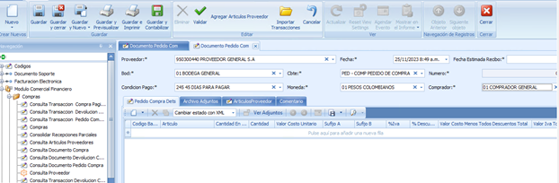

MÓDULO COMERCIAL FINANCIERO

Funcionalidad diseñada para gestionar y optimizar los procesos de adquisición de bienes y servicios dentro de una organización. Este módulo está centrado en las transacciones de compras, la gestión de proveedores y la administración eficiente de los recursos necesarios para mantener y mejorar la relación con los clientes.

# 1. PEDIDOS

Facilita la creación y seguimiento de órdenes de compra para adquirir productos o servicios de proveedores externos.

## 1.1 PEDIDO DE COMPRAS

Se ubica en el Módulo Comercial Financiero/Pedido Compra

Hacer un pedido de compra es decirle a mi proveedor que le quiero comprar algo, que me separe esa mercancia, para posterirmente hacer la compra.

Damos clic en Nuevo para generar el pedido de compra.
Debemos llenar en el encabezado los campos marcados con \* proveedor, fecha estimada recibo, bodega, comprobante, condición de pago, moneda, comprador.

