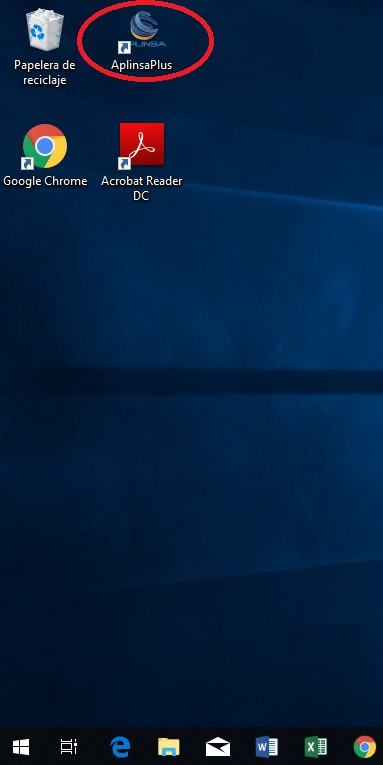
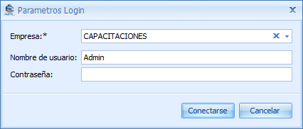
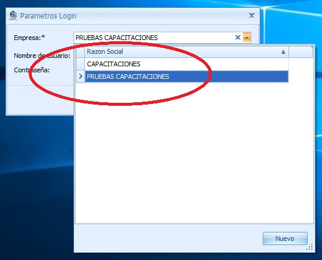

import Tabs from '@theme/Tabs';
import TabItem from '@theme/TabItem';

# Funcionalidades

:::info

Cómo realizar una **cotización**

:::

# Acceso al Programa

El programa está desarrollado con entorno para Windows, se ubica un icono en el escritorio para acceder.
En pantalla está el icono que representa Aplinsa.



- **Empresa**: El programa permite crear varias empresas (Abajo se amplía la descripción de este campo)
- **Nombre de usuario**: Usuario asignado por el administrador del programa.
- **Contraseña**: clave de acceso (abajo se amplía la descripción de este campo)





# Navegación

<Tabs>
  <TabItem value="apple" label="Apple" default>
    This is an apple 🍎
  </TabItem>
  <TabItem value="orange" label="Orange">
    This is an orange 🍊
  </TabItem>
  <TabItem value="banana" label="Banana">
    This is a banana 🍌
  </TabItem>
</Tabs>

<br/>

Su entorno gráfico es el siguiente:
En las siguientes imágenes se describen sus funcionalidades.
En este grid muestra la distribución de sus módulos, Código, Facturación, Módulo comercial
Financiero, Módulo CRM, Módulo CRM, Módulo Taller, Módulo Contabilidad, Módulo Niif,
Informes, Mantenimiento, Configuraciones, Procesos, Modulo Despachos, Modulo Sector Salud,
POS, Usuarios.
En codigos es el modulo donde se codifican todo lo de Aplinsa, articulos, tipos de comprobante,
moneda, pais, etc.

En la parte baja informa a qué empresa está conectado y con qué usuario.
Empresa seleccionada y usuario conectado

## Cinta de Herramientas Primarias - Navegación:

Lista cada uno de los módulos de trabajo que tiene el usuario para acceder.

## Apariencia

El usuario tiene múltiples opciones para darle su tono de color gráfico y diferentes formas de
trabajo que más le guste.
En esta sección elegimos un tema visual para nuestra aplicación.
Algunos ejemplos de apariencia.

### Apariencia completa

lalalalalalal

#### Apariencia completa b

klklkllklkl

## Lista de Ventanas

Hay múltiples opciones para listar las ventanas (pestañas abiertas).
Se pueden poner las ventanas en modo vertical y horizontal, también esta la opción de restablecer
distribución de ventanas.

Miremos uno a uno qué hace cada acción de la lista de ventanas:

- Nueva Ventana de Grupo Horizontal: Ubica horizontalmente todas las pestañas abiertas.
- Nueva Pestaña de Grupo Vertical: Ubica verticalmente todas las pestañas abiertas.
- Cerrar Todos los Documentos: Al tener varias pestañas abiertas, esta función cierra todas las pestañas al mismo tiempo.
- Restablecer Distribución de Ventanas: Vuelve al estado por defecto la organización de las ventanas.
- Ventanas de Acceso: Por esta opción le permite acceder a cada una de las pestañas con la que está trabajando.

## Paneles

```jsx title="/src/components/HelloCodeTitle.js"
function HelloCodeTitle(props) {
  return <h1>Hello, {props.name}</h1>;
}
```

En esta opción tiene varias formas de visualizar el panel de navegación:

- VISIBLE: Mantiene el grid de navegación anclado sin que se oculte.
- OCULTAR AUTOMATICAMENTE: Desancla la navegación y la mantiene oculta. Solo con desplazar el mouse hacia el grid de navegación vuelve y lo muestra.
- OCULTOS: Lo oculta completamente, para volver a habilitarla debe ir nuevamente a PANELES / NAVEGACIÓN.

## Pestaña Inicio

Se describen los iconos más comunes y su funcionamiento en el programa, esta pestaña solo se
activa si seleccionamos un movimiento, transacción o documento.

- Nuevo: Crea un nuevo documento de acuerdo a la caja en la que se encuentre. Funcionalidad con el teclado: (Ctrl + N)
- Iconos de Guardado: Donde permite solo guardar y cerrar al momento de guardar el documento elaborado o los movimientos realizados.
  - Guardar
  - Guardar y Cerrar
  - Guardar y Nuevo
    Funciones de teclado: Ctrl + S, Ctrl + Return
- Mostrar Transacciones de Compra: Muestra las transacciones realizadas de un documento, esta se habilita cuando se está realizando una consulta.

  2.2.3
  VISUALIZAR IMPRESION DE DOCUMENTOS
  Seleccionando un documento o un informe ya elaborado tenemos varias herramientas para la
  impresión, guardado, exportación y muchas más para diferentes necesidades del usuario.
  Damos doble click al documento que queremos imprimir
  Damos en guardar y pre visualizar y se abre el visor donde vemos la representación gráfica de lo
  que vamos a imprimir
  Unas de las opciones en exportar a diferentes formatos como PDF, XLS, CSV, JPEG, entre otros.
  Si se procede a exportar en PDF, pide varios criterios como rangos de hojas a exportar, calidad de
  la imagen, si quiere el documento generado con contraseña, titulo. El usuario de acuerdo a su
  necesidad tiene estas múltiples opciones.

Por último debe ubicar en que ruta de su equipo local desea guardarlo.

Proceder a visualizar el informe en formato PDF
Se muestra un ejemplo de cómo también sale en formato xls para Excel.

Para cerrar la vista del documento solo va a la parte superior derecha.
Este visualizador también tiene algunas herramientas que se relacionan a continuación:
Impresión de documentos
Teclado: Ctrl + P
Guardar y abrir un documento en formato prnx
Teclado Abril: Ctrl + O
Teclado Guardar: Ctrl + S

Configuración de la imagen, como expandir y reducir, si se cambia de vertical a horizontal,
márgenes y tamaño de la imagen.
Buscador de textos, vista del informe y visualizador de página.
Reducir o ampliar la página, seleccionar y desplazamiento en el documento con mano y puntero.
Si el usuario requiere cambiar el fondo del documento lo puede utilizar con esta herramienta para
cambiarla al color que necesite.
